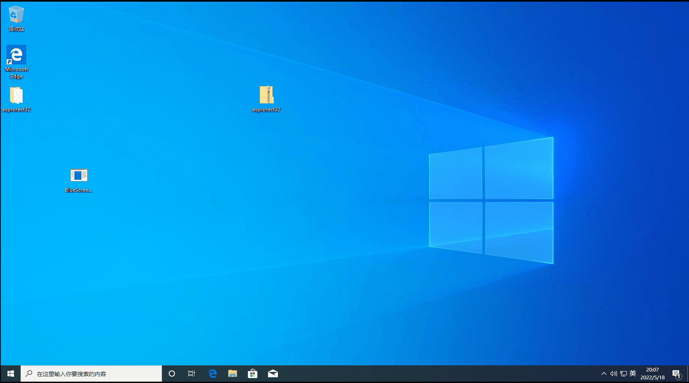

# BlueScreenJoke

一个自发引起虚假Windows BSoD错误的整蛊程序。

### 用法

* 直接启动将显示确认对话框

* 可以从命令行启动直接唤起蓝屏

### 原理

调用`ntdll.dll`中内核函数`RtlAdjustPrivilege`升高当前进程权限，然后使用内核错误函数`NtRaiseHardError`产生BOSD错误。您可以更改源代码更改错误的类型，默认为`0xC000021A`(并不存在)

